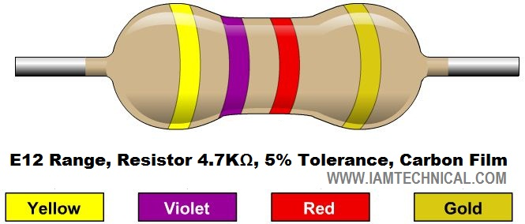
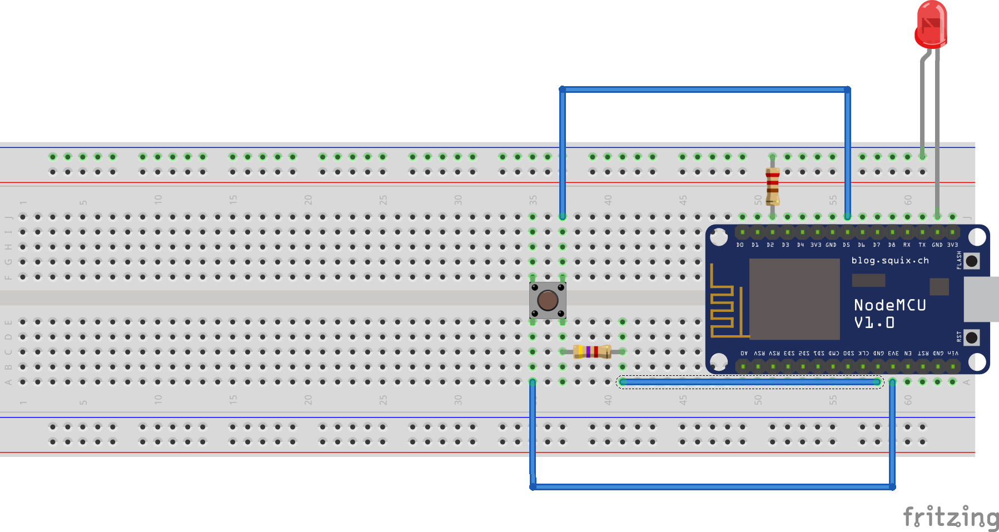
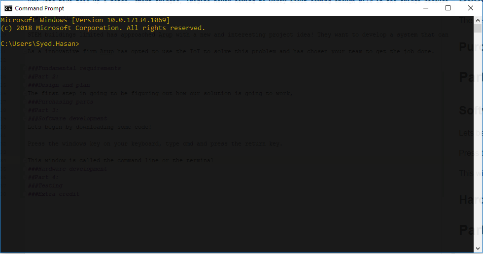
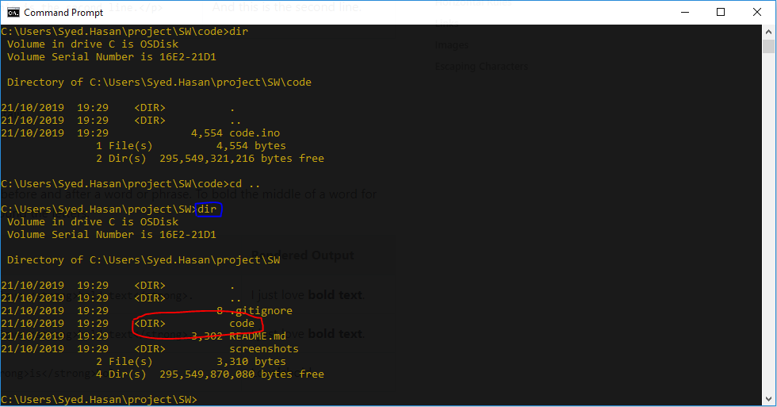
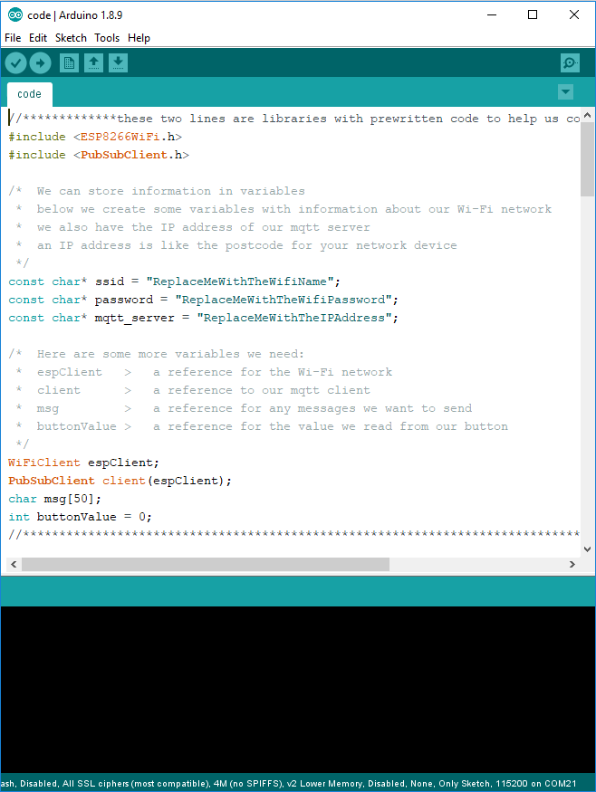

# Arup Stem Workshop

Hello and welcome to this workshop hosted by Arup.

## Part 1:
### Introduction to the IoT

IoT stands for Internet of Things. A concept where everything is connected to the internet, from smart devices to your everyday appliances.

So why would you want to connect everything to the internet?

Imagine the amount of Energy consumed when you leave a room and forget to turn off the lights. Or imagine you travel to somewhere really nice and far away, but suddenly you remember you didn't turn off your heater or even worse you forgot to lock your front door!

 Let's say you're using your favourite pen, writing all your best ideas down. Just as you get to your last sentence, your ink runs out!!!

If there was only a way that you could communicate with these devices from where ever you are and be able to get a notification as to the current state of your front door, or the room temperature in your house right now. You could add a connected sensor that could send a message to the internet letting you know via your favourite app that your if your front door is open and the current temperature of your bedroom.

But it gets even better, you could send a command to turn the heating off and lock the front door!

Now lets take this up a notch, smart fridges, smart stationary, imagine never having to worry about having enough milk in the fridge because your fridge will buy it for you.

### The challenge

 STEM buildings limited has approached Arup with a new and interesting project idea! They want to develop a system that can control meeting room lights from any location.

Arup as a sustainable company is very big on energy savings and creating sustainable environments. As an innovative firm, Arup has opted to use the IoT to solve this problem and has chosen your team to get the job done.

### Fundamental requirements
## Part 2:
### Design and plan
The first step in going to be figuring out how our solution is going to work,
### Purchasing parts
What you need:
 - Breadboard
 - Jumper Cables
 - LEDs
 - Switch
 - Wi-Fi Enabled Microprocessor
 - 1No. 220 Ohms Resistor

 

 - 1No. 4.7k Ohms Resistor

   

## Part 3:
###Hardware development

Using the components you got in **part 2** build the following circuit



- Push the micro-controller into the breadboard as shown in the image above, line up pin **D0** with **I49** and pin **Vin** with **B64** 
- Place the 220 ohm resistor between pin **J51** on the bread board and the blue rail
- Place the **long leg** of the LED in the blue rail and the **short** leg in pin **J62**
- Align the button switch so that its fits between **E37** and **F39**
- Place the 4.7 Kohm resistor between pins **A39** and **A58**
- Place a jumper cable between pin **A37** and **A59**
- Place a jumper cable between pin **J39** and **J56**

If you've done this correctly, when the code uploads to the micro-controller you should be able to turn your LED on and off.

### Software development
Lets begin by writing some code!

Press the Windows key on your keyboard, type cmd and press the return key.

This window is called the command line or the terminal



In the terminal type the following two commands

```
mkdir project
cd project
```

You've just created a folder called "project" using ```mkdir project``` and you've moved into it using ```cd project```

Now we're going to download the Arduino project from our code repository using the command
```cmd
git clone https://gitlab.arup.com/Syed.Hasan/SW.git
cd SW
```

If you type this, it should list all the files that have been cloned from the repository
```cmd
dir
```


You should see a folder called code, let's go into that folder and open our code in the Arduino IDE

```cmd
cd code
start code.ino
```

The editor will look like this



Scroll through the code and enter in the correct details as described in the points below
- For our device to connect to our server, we have to provide it with the Wi-Fi credentials and the server IP address. 
Fill in the details as shown on the board
- Scroll down to the variable ``teamName`` and enter your teamName, This will tell your micro-controller who's light to control

Our code should now be ready to compile and upload to the micro-controller.
We need to tell out IDE what micro-controller we are using, to do this click on ``Tools > Board > NodeMCU 1.0 (ESP12-E Module)``.
We also need to tell the IDE which USB port or communication(COM) port to use, since our computer has multiple USB ports we need to make sure we select the correct one.
It will most likely by a number greater than 10, so now click on ``Tools > Port > `` and select an the COM port that you think is correct.

If you selected the correct COM port we should be ready to do the last step, click on the green arrow pointing to the right, if you hover over it, it should say ``Upload``.

In the black window at the bottom of the IDE, you will now see some messages about the compilation and code upload. Once the upload is complete a message on the blue bar will say ``Done uploading`` and your micro-controller will now begin to work.

##Part 4:
###Testing
To see what your micro-controller is doing, open the `Serial Monitor` by pressing the key `Ctrl+Shift+M`.

If you click the button on your circuit, your LED will should turn on. 
###Extra credit
So now we can control our LED remotely. What can you change to your code to control another teams LED???
